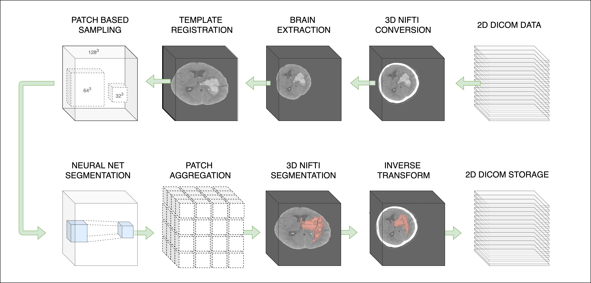

## DeepBleed

<!-- badges: start -->
[](https://travis-ci.com/msharrock/deepbleed)
<!-- badges: end -->

ICH volumetric estimation is a task routinely performed in clinical research. This is the first publicly available deep neural network model to perform the task of ICH segmentation and volume estimation. The model expects non-contrast CT in NIfTI format and automatically performs preprocessing including a validated CT brain extraction method and spatial normalization via registration to a 1.5mm x 1.5mm x 1.5mm CT template with a shape of (128, 128, 128). 
 <br/>



Current dependencies are listed below. 

Software | Version | URL
------------ | ------------- | -------------
Tensorflow | gpu-2.1.0 | https://www.tensorflow.org
ANTsPy | 0.1.7 | https://github.com/ANTsX/ANTsPy
FSLPy | 2.7.0 | https://git.fmrib.ox.ac.uk/fsl/fslpy
FSL\* | 6.0.2 | https://fsl.fmrib.ox.ac.uk/fsl/fslwiki

\*Please read and agree to the software license for FSL prior to use. 
<br/>

To run an ICH prediction set the path to directories for inputs, outputs and model weights:
```bash
$ python3 predict.py --indir /path/to/inputs/ --outdir /path/to/outputs/ --weights /path/to/weights 
```

Link to weights: [Mistie 2](https://drive.google.com/drive/folders/1VzU8gcVARb9Tq5tFOwNsIqPCL0css-iN?usp=sharing)

You will likely want to rename the files beginning with a `.` to a common prefix, such as `weights` (e.g. `.index` becomes `weights.index`).

You may optionally specify the number of GPUs and CPUs to use with --gpus and --cpus.

### DeepBleed Docker

Alternatively, you can pull a pre-built docker image with the dependencies installed:
```bash
$ docker pull msharrock/deepbleed 
```

<br/>

To run a prediction, start the docker image, link the data path that contains the indir and outdir:
```bash
$ docker run -it msharrock/deepbleed bash -v /path/to/data:/data/ 
```
Pull this repository from github and then run predictions as previously noted

### Directions for OSX

For OSX, you should likely install `ANTsPy` using a git install of:
```bash
pip install git+git://github.com/ANTsX/ANTsPy.git
```

But you can try a release from the releases page: https://github.com/ANTsX/ANTsPy/releases
```bash
python3.7 -m pip install https://github.com/ANTsX/ANTsPy/releases/download/v0.1.8/antspyx-0.1.8-cp37-cp37m-macosx_10_14_x86_64.whl
```

### License
Please see LICENSE.md for information of the license and uses.
